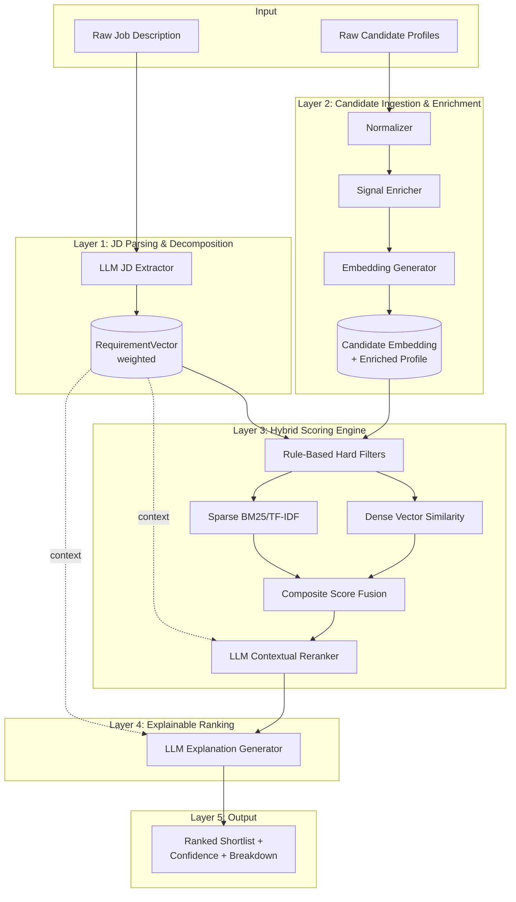
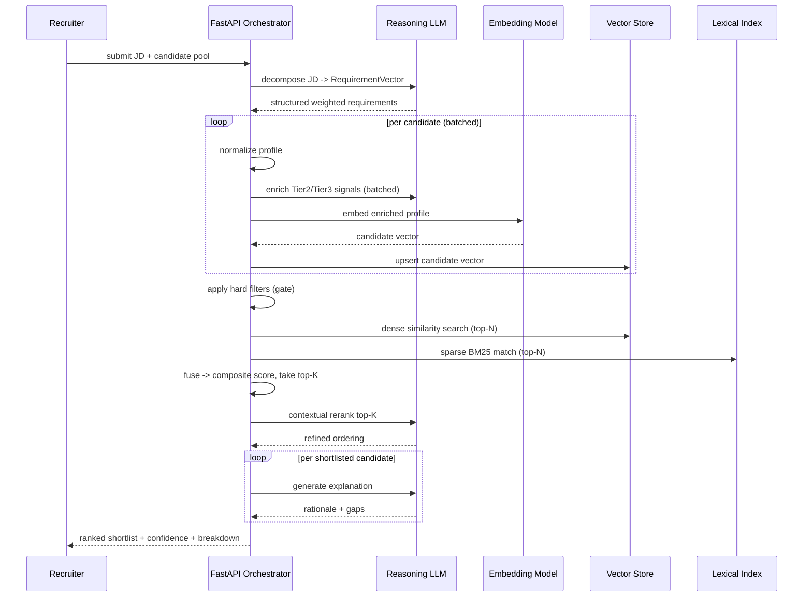

# Design Document: Intelligent Candidate Ranking System (ICRS)

## Overview

The Intelligent Candidate Ranking System (ICRS) ranks job candidates the way a world-class human recruiter would: through semantic understanding, behavioral inference, and multi-signal scoring rather than brittle keyword matching. The core problem it solves is the false-negative blind spot of keyword-based ATS filters, which discard strong candidates whose resumes do not literally echo the job description's vocabulary.

ICRS decomposes a job description into a structured, weighted requirement schema, enriches each candidate profile with inferred semantic and behavioral signals, and fuses four complementary scoring methods (dense vector similarity, sparse keyword matching, rule-based hard filters, and LLM contextual reranking) into a single explainable composite score. Every ranking is accompanied by a recruiter-readable rationale that names the driving signals and surfaces gaps, so the system augments rather than replaces human judgment.

This document is the architectural blueprint for a Proof of Concept (PoC). It covers both the high-level architecture (pipeline, components, data flow, data models) and the low-level design (scoring formulas, algorithms with formal specifications, and schema definitions). It also documents the technology choices, development roadmap, key technical decisions, and the path from PoC to production. All algorithms are expressed as structured pseudocode; no production implementation code is included.

---

## Requirement Analysis

ICRS reasons over three tiers of candidate signals plus a dedicated JD understanding capability. The tiers are deliberately separated so weights can be tuned per job type and so missing data in one tier does not corrupt the others.

### Signal Tier 1 — Structural (high confidence, low ambiguity)

Extracted directly from structured profile fields. These are deterministic and cheap to compute.

- Title progression (junior → senior → lead → staff/manager)
- Tenure per role and aggregate tenure
- Industry and sub-domain
- Company prestige (tiered reference set, not a hard gate)
- Education level and field
- Certifications
- Explicitly listed skills

### Signal Tier 2 — Semantic (medium confidence, inference required)

Derived from free-text via embeddings and LLM extraction.

- Inferred responsibilities from prose ("led migration of monolith to microservices" → architecture, leadership, distributed systems)
- Implicit skills not explicitly listed but evidenced by described work
- Career trajectory arc (accelerating, steady, lateral, declining)
- Domain depth versus breadth (specialist vs generalist signature)

### Signal Tier 3 — Behavioral / Activity (variable confidence, freshness-sensitive)

Derived from external platform signals where available.

- Platform engagement: GitHub commits, LinkedIn activity, publications, open-source contributions, endorsements
- Recency of activity (freshness-weighted)
- Consistency of expertise claims (claimed skills corroborated by activity)

### JD Understanding Module

The JD parser must extract intent, not just surface tokens:

- Role intent (the actual job to be done, distinct from the title)
- Must-have vs nice-to-have vs disqualifying criteria
- Seniority band inference (from scope language, not title alone)
- Culture/domain fit signals hidden in JD language
- Implicit expectations (e.g., "fast-paced startup" implies adaptability and ownership; "regulated environment" implies compliance discipline)

---

## Architecture

ICRS is a five-layer pipeline. Each layer has a single responsibility and a typed contract with the next, which keeps the LLM-bearing layers isolated and independently testable.



### Layer responsibilities

1. **JD Parsing & Decomposition Layer** — Transforms a raw JD into a structured `RequirementVector` via a single LLM extraction call. Output: weighted requirement vectors with must-have / nice-to-have / disqualifying classification and an inferred seniority band.

2. **Candidate Ingestion & Enrichment Layer** — Normalizes structured and unstructured profiles into a canonical schema, enriches them with Tier 2 and Tier 3 inferred signals, and produces a multi-dimensional candidate embedding. Embedding generation is a vector op; signal inference is a mix of deterministic rules and (optionally batched) LLM calls.

3. **Hybrid Scoring Engine** — Fuses four methods: rule-based hard filters (deterministic gate), dense vector similarity (semantic), sparse keyword matching via BM25/TF-IDF (lexical recall), and LLM contextual reranking (nuanced judgment over the top-K). Signal-tier weights are configurable per job type.

4. **Explainable Ranking Layer** — Generates a recruiter-readable explanation per candidate: why they rank where they do, the driving signals, and the gaps. One LLM call per shortlisted candidate (batchable).

5. **Output Layer** — Emits the ranked shortlist with confidence scores, per-signal breakdowns, and recruiter-facing summaries.

### Where each computation happens

| Stage | Computation type | Cost driver |
|-------|------------------|-------------|
| JD decomposition | LLM call (1 per JD) | High-quality reasoning model |
| Profile normalization | Deterministic parsing | CPU only |
| Signal enrichment (Tier 2/3) | LLM call (batched) + rules | Batched LLM + API fetches |
| Embedding generation | Vector op (embedding model) | Embedding model throughput |
| Hard filters | Rule logic | CPU only |
| Dense similarity | Vector op (ANN search) | Vector store |
| Sparse matching | BM25/TF-IDF | CPU / lexical index |
| Contextual reranking | LLM call (top-K only) | Reasoning model, K-bounded |
| Explanation generation | LLM call (shortlist only) | Reasoning model, N-bounded |

### End-to-end sequence



---

## Technology Stack Recommendation

Choices are justified along three axes: accuracy, latency, and cost. The PoC optimizes for fast iteration and explainability; production-leaning notes are deferred to the Scalability section.

### Embedding models

| Model | Accuracy | Latency | Cost | PoC fit |
|-------|----------|---------|------|---------|
| `text-embedding-3-large` (3072-dim) | High, strong out-of-box semantic quality | Low (hosted API) | Pay-per-token, no infra | **Recommended for PoC** — best accuracy with zero infra |
| `bge-large-en-v1.5` (1024-dim) | High, top open-source MTEB scores | Medium (self-host GPU) | Free model, GPU cost | Strong production candidate to cut per-token cost |
| `e5-mistral-7b-instruct` (4096-dim) | Very high, instruction-tuned, best for nuanced matching | High (7B params, GPU heavy) | High inference cost | Reserve for accuracy-critical reranking-grade embeddings |

**Decision (as built):** The PoC defaults to **local `bge-large-en-v1.5` (1024-dim) via `sentence-transformers`**, not the hosted `text-embedding-3-large`. Rationale: the build targets a **no-paid-API** constraint, and `text-embedding-3-large` requires a billed OpenAI key. `bge-large-en-v1.5` runs free on CPU, scores near the top of the MTEB retrieval board, and keeps candidate/requirement embeddings in one comparable space. The `EmbeddingProvider` interface stays abstract (model id, dimensionality, and device are configurable in `icrs/config.py`), so `text-embedding-3-large` or `e5-mistral-7b-instruct` can be repointed later without pipeline changes.

### Vector store

| Store | Strengths | Tradeoffs | PoC fit |
|-------|-----------|-----------|---------|
| Pinecone | Fully managed, zero-ops, fast | Hosted-only, recurring cost | Good if avoiding ops entirely |
| Qdrant | Strong filtering, open-source, easy local + cloud | Self-host for free tier | **Recommended for PoC** — rich payload filtering matches hard-filter needs |
| Weaviate | Hybrid search built in, modules | Heavier to operate | Strong if leaning on built-in hybrid |
| ChromaDB | Trivial local setup, dev-friendly | Limited scale/filtering | Good for the earliest prototype |

**Decision:** Start with Qdrant (its metadata filtering cleanly supports hard-filter pre-gating, and it runs locally and in cloud). ChromaDB is acceptable for the very first Phase 1 spike.

### Reasoning LLMs (role-specialized)

Original design intent (vendor-agnostic, by comparative strength):

| Task | Model (design intent) | Rationale |
|------|-------|-----------|
| JD decomposition | GPT-4o | Reliable structured/JSON extraction, strong instruction following, fast |
| Contextual reranking | Claude Sonnet 4 | Strong nuanced judgment and long-context reasoning over multiple candidates; good cost/quality balance for K-bounded reranking |
| Explanation generation | Gemini 1.5 Pro | Long context for full profile + JD, fluent recruiter-facing prose, cost-effective at shortlist volume |

**Decision (as built):** GPT-4o and Claude Sonnet 4 both require paid accounts, which the PoC avoids. The implemented binding (routed through `LLMProviderRegistry` by `LLMTask`, configurable in `icrs/config.py`) is:

| Task | Implemented model | Provider | Rationale |
|------|-------------------|----------|-----------|
| JD decomposition | `llama-3.3-70b-versatile` | **Groq** | Strong JSON/structured extraction on Groq's free-tier, very low latency |
| Tier-2 enrichment | `llama-3.3-70b-versatile` | **Groq** | Same model reused for batched semantic inference |
| Contextual reranking | `llama-3.3-70b-versatile` | **Groq** | Nuanced ordering over the top-K within the free-tier budget |
| Explanation generation | `gemini-1.5-pro` | **Google (free tier)** | Long context for profile + JD; fluent recruiter-facing prose |

The model interface is abstracted so any task can be repointed; the per-task registry means a single concrete provider (or model id) can be swapped without touching pipeline code. Note: a 401 from a provider (e.g. Groq `invalid_api_key`) surfaces at the first LLM call — JD decomposition — and indicates a missing/invalid key in the environment, not a pipeline fault.

### Orchestration

- **Custom thin orchestration** over async Python, with **LlamaIndex** used selectively for retrieval/ingestion utilities.
- Rationale: full-framework LangChain adds abstraction overhead and obscures the explicit, auditable data flow ICRS needs (especially for explainability and bias controls). A custom orchestrator keeps the pipeline transparent; LlamaIndex covers chunking and vector-store adapters without owning control flow.

### Backend

- **FastAPI (async)** — native async fits the I/O-bound mix of LLM calls, embedding calls, and vector queries; lets independent candidates be enriched and scored concurrently.
- **As built:** `icrs/api/app.py` exposes `create_app(orchestrator=...)` with `POST /rank` (submit JD + job type + candidate pool → ranked shortlist) and `GET /health`. Providers are wired **lazily** so importing/creating the app makes no network call; tests inject a stub-backed orchestrator. Invalid input (empty JD / empty pool) maps to HTTP 400. **Security:** the endpoint is **unauthenticated (PoC only)** and flagged as such in code — production must add auth/authz and rate limiting before exposure.

### Frontend (PoC UI)

- **Streamlit** for the PoC — fastest path to a recruiter-facing dashboard (upload JD, view ranked shortlist, expand explanations and signal breakdowns). 
- Migration note: move to a **Next.js** minimal dashboard when multi-user, auth, and richer interaction are needed for production.

### Data layer — PostgreSQL + pgvector vs dedicated vector DB

- **PostgreSQL + pgvector**: use as the **system of record** for JDs, candidate profiles, and ranking results, and for embedded vectors at PoC scale. One store, transactional, simple ops, good for moderate vector counts.
- **Dedicated vector DB (Qdrant)**: use when vector count, ANN recall/latency, and advanced filtering exceed what pgvector serves comfortably.
- **Rule of thumb:** PoC and small pools → pgvector only (fewer moving parts). As candidate volume and query latency requirements grow → keep relational data in PostgreSQL and offload vector search to Qdrant, syncing IDs between them.

---

## Components and Interfaces

Interfaces are expressed in structured pseudocode. Each component is independently testable behind its contract.

### Component 1: JD Decomposer

**Purpose**: Convert a raw JD into a structured, weighted `RequirementVector`.

```pascal
INTERFACE JDDecomposer
  PROCEDURE decompose(rawJD: String): RequirementVector
    // Single LLM extraction call.
    // Classifies each requirement as MUST_HAVE | NICE_TO_HAVE | DISQUALIFYING.
    // Infers seniority band and implicit expectations.
END INTERFACE
```

**Responsibilities**:
- Extract role intent distinct from the title
- Classify and weight each requirement
- Infer seniority band from scope language
- Surface implicit/cultural expectations

### Component 2: Candidate Enricher

**Purpose**: Normalize a raw profile and attach inferred Tier 2 / Tier 3 signals.

```pascal
INTERFACE CandidateEnricher
  PROCEDURE normalize(rawProfile: RawCandidate): NormalizedProfile
  PROCEDURE enrich(profile: NormalizedProfile): EnrichedProfile
    // Adds inferred responsibilities, implicit skills, trajectory arc,
    // depth/breadth signature, and behavioral/activity signals with freshness.
END INTERFACE
```

**Responsibilities**:
- Canonicalize heterogeneous profile formats
- Infer Tier 2 semantic signals via LLM (batched)
- Fetch and freshness-weight Tier 3 behavioral signals
- Flag missing/sparse signals (without penalizing — see Key Decisions)

### Component 3: Embedding Generator

**Purpose**: Produce a multi-dimensional candidate embedding from the enriched profile.

```pascal
INTERFACE EmbeddingGenerator
  PROCEDURE embed(profile: EnrichedProfile): Vector
  PROCEDURE embedRequirement(req: RequirementVector): Vector
END INTERFACE
```

**Responsibilities**:
- Chunk long profiles and aggregate chunk embeddings (see Key Decisions)
- Maintain a consistent embedding space for candidates and requirements

### Component 4: Hybrid Scoring Engine

**Purpose**: Apply hard filters, run dense + sparse retrieval, fuse into a composite score, and contextually rerank the top-K.

```pascal
INTERFACE HybridScoringEngine
  PROCEDURE hardFilter(reqs: RequirementVector, cand: EnrichedProfile): FilterResult
  PROCEDURE denseScore(reqVec: Vector, candVec: Vector): Float        // [0,1]
  PROCEDURE sparseScore(reqs: RequirementVector, cand: EnrichedProfile): Float  // BM25, normalized [0,1]
  PROCEDURE composite(signals: SignalBundle, weights: WeightProfile): Float
  PROCEDURE rerank(topK: List<ScoredCandidate>, reqs: RequirementVector): List<ScoredCandidate>
END INTERFACE
```

**Responsibilities**:
- Gate out disqualified candidates deterministically before expensive ops
- Compute and normalize each sub-score
- Fuse using the configured weight profile
- LLM-rerank only the top-K to bound cost

### Component 5: Explanation Generator

**Purpose**: Produce recruiter-readable rationale per shortlisted candidate.

```pascal
INTERFACE ExplanationGenerator
  PROCEDURE explain(cand: ScoredCandidate, reqs: RequirementVector): Explanation
    // Names driving signals, gaps, and confidence basis. One LLM call per candidate.
END INTERFACE
```

**Responsibilities**:
- Translate numeric breakdown into plain-language rationale
- Explicitly list gaps and unmet must-haves
- Avoid leaking demographic/proxy attributes into rationale

### Component 6: Ranking Orchestrator

**Purpose**: Coordinate the full pipeline and assemble the output.

```pascal
INTERFACE RankingOrchestrator
  PROCEDURE rankCandidates(rawJD: String, pool: List<RawCandidate>,
                           jobType: JobType): List<RankingResult>
END INTERFACE
```

---

## Data Models

All schemas in structured pseudocode. Embeddings are stored alongside relational records (pgvector) at PoC scale.

### Model: JobDescription

```pascal
STRUCTURE JobDescription
  id: UUID
  raw_text: String                 // original JD as submitted
  title: String
  submitted_at: Timestamp
  parsed: RequirementVector        // populated by JD Decomposer
  job_type: JobType                // TECHNICAL | LEADERSHIP | GENERALIST | SALES | ...
END STRUCTURE
```

**Validation Rules**:
- `raw_text` non-empty
- `parsed` is null until decomposition succeeds
- `job_type` drives weight-profile selection

### Model: RequirementVector

```pascal
STRUCTURE Requirement
  text: String
  category: Enum { MUST_HAVE, NICE_TO_HAVE, DISQUALIFYING }
  tier: Enum { STRUCTURAL, SEMANTIC, BEHAVIORAL }
  weight: Float                    // [0,1], relative importance within category
  embedding: Vector                // for dense matching
END STRUCTURE

STRUCTURE RequirementVector
  job_id: UUID
  role_intent: String              // the job to be done, not the title
  seniority_band: Enum { JUNIOR, MID, SENIOR, STAFF, LEAD, EXECUTIVE }
  requirements: List<Requirement>
  implicit_expectations: List<String>   // e.g., "adaptability", "ownership"
  culture_signals: List<String>
END STRUCTURE
```

**Validation Rules**:
- At least one MUST_HAVE requirement
- Sum of weights within a category normalized to 1.0
- DISQUALIFYING requirements are hard gates, not weighted contributors

### Model: CandidateProfile

```pascal
STRUCTURE RawCandidate
  id: UUID
  structured_fields: Map<String, Any>   // titles, dates, education, skills
  free_text: String                     // summaries, descriptions
  external_handles: Map<String, String> // github, linkedin, scholar, ...
END STRUCTURE

STRUCTURE NormalizedProfile
  id: UUID
  roles: List<Role>                      // {title, company, start, end, prestige_tier}
  education: List<Education>
  certifications: List<String>
  explicit_skills: List<String>
  total_tenure_months: Integer
END STRUCTURE

STRUCTURE EnrichedProfile
  id: UUID
  base: NormalizedProfile
  inferred_responsibilities: List<String>     // Tier 2
  implicit_skills: List<String>               // Tier 2
  trajectory_arc: Enum { ACCELERATING, STEADY, LATERAL, DECLINING }  // Tier 2
  depth_breadth: Enum { SPECIALIST, BALANCED, GENERALIST }           // Tier 2
  behavioral_signals: List<BehavioralSignal>  // Tier 3
  signal_availability: Map<SignalTier, Float> // coverage [0,1] per tier
  embedding: Vector
END STRUCTURE

STRUCTURE BehavioralSignal
  source: String                    // "github", "linkedin", "publications"
  metric: String                    // "commit_frequency", "endorsements"
  value: Float
  recency_days: Integer             // for freshness weighting
  corroborates_skill: List<String>  // for consistency check
END STRUCTURE
```

**Validation Rules**:
- `signal_availability` recorded per tier so missing data is treated as "unknown", never as zero (see Key Decisions)
- `embedding` dimensionality matches the configured embedding model

### Model: RankingResult

```pascal
STRUCTURE SignalBreakdown
  semantic_fit: Float
  career_trajectory: Float
  behavioral: Float
  hard_filter_pass: Float
  disqualifying_penalty: Float
END STRUCTURE

STRUCTURE RankingResult
  job_id: UUID
  candidate_id: UUID
  final_score: Float                // [0,1]
  rank: Integer
  breakdown: SignalBreakdown
  explanation: Explanation
  confidence: Float                 // [0,1], driven by signal coverage + score margin
END STRUCTURE

STRUCTURE Explanation
  summary: String                   // recruiter-facing
  driving_signals: List<String>
  gaps: List<String>
  unmet_must_haves: List<String>
END STRUCTURE
```

**Validation Rules**:
- `rank` is unique within a `job_id`, contiguous from 1
- `confidence` is reduced when `signal_availability` is low or the score margin to neighbors is small

---

## Scoring Architecture

### Composite model

```
FinalScore = w1 * SemanticFitScore
           + w2 * CareerTrajectoryScore
           + w3 * BehavioralSignalScore
           + w4 * HardFilterPassScore
           - w5 * DisqualifyingFlagPenalty
```

All sub-scores are normalized to `[0,1]` before weighting. The result is clamped to `[0,1]`. `HardFilterPassScore` is a soft pass-ratio over must-haves; a hard disqualification is handled by the gate (a disqualified candidate is removed before composite scoring, and `DisqualifyingFlagPenalty` captures softer red flags such as unexplained gaps or expired hard credentials).

### How each sub-score is computed

```pascal
PROCEDURE SemanticFitScore(reqVec, candVec, reqs, cand)
  // Blend of dense and sparse signals.
  dense  ← cosineSimilarity(reqVec.aggregate_embedding, candVec)   // [0,1]
  sparse ← normalizedBM25(reqs, cand.text_corpus)                  // [0,1]
  RETURN 0.7 * dense + 0.3 * sparse   // dense-favored; recall safety from sparse
END PROCEDURE

PROCEDURE CareerTrajectoryScore(cand, reqs)
  // Reward arc alignment with required seniority and growth pattern.
  arcScore     ← mapArcToScore(cand.trajectory_arc)        // ACCELERATING high
  bandMatch    ← seniorityAlignment(cand, reqs.seniority_band)
  depthMatch   ← depthBreadthAlignment(cand.depth_breadth, reqs)
  RETURN mean(arcScore, bandMatch, depthMatch)
END PROCEDURE

PROCEDURE BehavioralSignalScore(cand)
  // Freshness-weighted aggregation; absence != zero.
  IF cand.signal_availability[BEHAVIORAL] = 0 THEN
    RETURN NEUTRAL_PRIOR      // e.g., 0.5, see Key Decisions on sparse signals
  END IF
  total ← 0
  FOR each s IN cand.behavioral_signals DO
    fresh ← freshnessWeight(s.recency_days)   // exponential decay
    total ← total + fresh * normalize(s.value)
  END FOR
  RETURN clamp(total / count(cand.behavioral_signals), 0, 1)
END PROCEDURE

PROCEDURE HardFilterPassScore(reqs, cand)
  // Soft ratio of satisfied must-haves (the binary gate is separate).
  satisfied ← count(must-haves met by cand)
  RETURN satisfied / count(must-haves in reqs)
END PROCEDURE

PROCEDURE DisqualifyingFlagPenalty(reqs, cand)
  // Soft red flags only; hard disqualifiers are gated out earlier.
  flags ← detectSoftFlags(cand, reqs)   // expired cert, unexplained gap, claim/activity mismatch
  RETURN clamp(0.2 * count(flags), 0, 1)
END PROCEDURE
```

### Default weights and per-job-type configuration

Default `WeightProfile` (must satisfy `w1+w2+w3+w4 = 1.0`; `w5` is an independent penalty coefficient):

```pascal
DEFAULT_WEIGHTS = { w1: 0.40, w2: 0.20, w3: 0.15, w4: 0.25, w5: 0.30 }
```

Per-job-type overrides reflect the recruiter intuition that different roles privilege different signals:

| Job type | w1 Semantic | w2 Trajectory | w3 Behavioral | w4 HardFilter | w5 Penalty | Rationale |
|----------|-------------|---------------|---------------|---------------|------------|-----------|
| TECHNICAL | 0.35 | 0.15 | **0.30** | 0.20 | 0.30 | Behavioral (commits, OSS) weighted higher |
| LEADERSHIP | 0.30 | **0.35** | 0.10 | 0.25 | 0.35 | Trajectory/arc weighted higher |
| GENERALIST | 0.45 | 0.20 | 0.10 | 0.25 | 0.25 | Semantic fit dominant |
| SALES | 0.35 | 0.30 | 0.10 | 0.25 | 0.30 | Trajectory (quota progression) emphasized |

Weight profiles are data, not code — stored per `job_type` and overridable per individual job.

### LLM contextual reranking

```pascal
PROCEDURE rerank(topK, reqs)
  // Only the top-K composite-scored candidates reach the LLM.
  prompt ← buildRerankPrompt(reqs, topK)   // includes breakdowns, not raw PII proxies
  ordering ← LLM.reorder(prompt)           // nuanced judgment over close calls
  // Blend LLM ordering with composite to avoid over-trusting the model.
  FOR each c IN topK DO
    c.final_score ← 0.6 * c.composite_score + 0.4 * llmScore(ordering, c)
  END FOR
  RETURN sortDescending(topK, by=final_score)
END PROCEDURE
```

---

## Algorithmic Pseudocode (Low-Level Design)

### Main ranking algorithm

```pascal
ALGORITHM rankCandidates(rawJD, pool, jobType)
INPUT: rawJD: String, pool: List<RawCandidate>, jobType: JobType
OUTPUT: results: List<RankingResult>

BEGIN
  ASSERT rawJD ≠ "" AND pool ≠ ∅

  // Step 1: Decompose JD (1 LLM call)
  reqs ← JDDecomposer.decompose(rawJD)
  reqVec ← EmbeddingGenerator.embedRequirement(reqs)
  weights ← selectWeightProfile(jobType)

  // Step 2: Ingest + enrich + embed each candidate
  enriched ← empty list
  FOR each raw IN pool DO
    ASSERT validProfile(raw)
    norm ← CandidateEnricher.normalize(raw)
    e    ← CandidateEnricher.enrich(norm)          // batched LLM enrichment
    e.embedding ← EmbeddingGenerator.embed(e)
    enriched.add(e)
  END FOR

  // Step 3: Hard-filter gate (deterministic, removes disqualified)
  survivors ← empty list
  FOR each e IN enriched DO
    fr ← HybridScoringEngine.hardFilter(reqs, e)
    IF fr.passed THEN survivors.add(e) END IF
  END FOR

  // Step 4: Composite scoring over survivors
  scored ← empty list
  FOR each e IN survivors DO
    INVARIANT every element already in 'scored' has a normalized final_score in [0,1]
    signals ← gatherSignals(reqVec, reqs, e)
    s ← HybridScoringEngine.composite(signals, weights)
    scored.add(ScoredCandidate(e, s))
  END FOR

  // Step 5: Take top-K, LLM rerank (K-bounded cost)
  topK ← takeTop(sortDescending(scored), K)
  reranked ← HybridScoringEngine.rerank(topK, reqs)

  // Step 6: Explanations for the shortlist (N-bounded)
  results ← empty list
  rankCounter ← 1
  FOR each c IN reranked DO
    exp  ← ExplanationGenerator.explain(c, reqs)
    conf ← computeConfidence(c, reranked)
    results.add(RankingResult(reqs.job_id, c.id, c.final_score,
                              rankCounter, c.breakdown, exp, conf))
    rankCounter ← rankCounter + 1
  END FOR

  ASSERT ranksAreContiguousAndUnique(results)
  RETURN results
END
```

**Preconditions:**
- `rawJD` is a non-empty job description
- `pool` contains at least one valid candidate
- `jobType` maps to a defined weight profile (falls back to DEFAULT_WEIGHTS)

**Postconditions:**
- Every returned `RankingResult` has `final_score ∈ [0,1]`
- Ranks are unique and contiguous from 1
- Disqualified candidates are absent from results
- Each result carries an explanation and a confidence score

**Loop Invariants:**
- Step 4 loop: all already-scored candidates hold a normalized score in `[0,1]`
- Step 6 loop: `rankCounter` equals one more than the number of results emitted so far

### Hard-filter gate

```pascal
ALGORITHM hardFilter(reqs, cand)
INPUT: reqs: RequirementVector, cand: EnrichedProfile
OUTPUT: FilterResult { passed: Boolean, reasons: List<String> }

BEGIN
  // Disqualifying criteria are absolute gates.
  FOR each r IN reqs.requirements WHERE r.category = DISQUALIFYING DO
    IF candidateMatches(cand, r) THEN
      RETURN { passed: false, reasons: ["disqualified: " + r.text] }
    END IF
  END FOR

  // Missing data is NOT a disqualification (fairness to sparse profiles).
  RETURN { passed: true, reasons: [] }
END
```

**Preconditions:** `reqs` decomposed; `cand` normalized.
**Postconditions:** Returns `passed=false` only when a disqualifying criterion is positively matched; never fails on absence of data.
**Loop Invariants:** Once any disqualifier matches, the procedure returns immediately (early termination).

### Profile chunking and embedding aggregation

```pascal
ALGORITHM embed(profile)
INPUT: profile: EnrichedProfile
OUTPUT: vector: Vector

BEGIN
  text ← serializeForEmbedding(profile)   // canonical, signal-ordered text

  IF length(text) ≤ MAX_TOKENS THEN
    RETURN embeddingModel.encode(text)
  END IF

  // Long profile: semantic chunking by role/section, then weighted aggregate.
  chunks ← chunkBySection(text)            // role-aligned, not arbitrary splits
  vectors ← empty list
  weights ← empty list
  FOR each ch IN chunks DO
    INVARIANT |vectors| = |weights|
    vectors.add(embeddingModel.encode(ch.text))
    weights.add(recencyAndRelevanceWeight(ch))   // recent/relevant chunks weighted up
  END FOR

  RETURN normalize(weightedMean(vectors, weights))
END
```

**Preconditions:** `profile` enriched; embedding model available.
**Postconditions:** Returns a unit-normalized vector in the model's dimensionality; recent and role-relevant content is weighted higher.
**Loop Invariants:** `vectors` and `weights` lists stay equal length throughout aggregation.

### Confidence computation

```pascal
ALGORITHM computeConfidence(cand, ranked)
INPUT: cand: ScoredCandidate, ranked: List<ScoredCandidate>
OUTPUT: confidence: Float in [0,1]

BEGIN
  coverage ← mean(cand.signal_availability over all tiers)   // more data -> more confidence
  margin   ← scoreMarginToNeighbors(cand, ranked)            // clearer separation -> more confidence
  RETURN clamp(0.6 * coverage + 0.4 * normalize(margin), 0, 1)
END
```

**Preconditions:** `cand` scored and present in `ranked`.
**Postconditions:** Confidence rises with signal coverage and with score separation from adjacent candidates.

---

## Correctness Properties

These are universal statements the system must satisfy; they drive property-based tests.

### Property 1: Score bounds

For every candidate, `final_score ∈ [0,1]`.

**Validates: Requirements 4.1**

### Property 2: Rank integrity

For any job, ranks are unique and contiguous from 1 to N (N = survivors after gating).

**Validates: Requirements 2.5, 5.3**

### Property 3: Monotonic ordering

If `candidate_a.final_score > candidate_b.final_score`, then `rank(a) < rank(b)`.

**Validates: Requirements 5.3**

### Property 4: Hard-filter soundness

A candidate positively matching any DISQUALIFYING criterion never appears in results.

**Validates: Requirements 1.4, 4.4**

### Property 5: Missing-data fairness

Absence of a signal never lowers a sub-score below the neutral prior; it only lowers confidence, not rank directly.

**Validates: Requirements 7.2**

### Property 6: Weight normalization

For every weight profile, `w1+w2+w3+w4 = 1.0`.

**Validates: Requirements 4.2, 4.3**

### Property 7: Determinism of deterministic stages

Given identical inputs and fixed model versions, hard filtering, dense/sparse scoring, and composite fusion produce identical outputs (LLM stages excluded).

**Validates: Requirements 2.3**

### Property 8: Explanation consistency

Every `unmet_must_have` listed in an explanation corresponds to a must-have requirement the candidate did not satisfy.

**Validates: Requirements 5.4**

### Property 9: Confidence coherence

A candidate with strictly higher signal coverage and equal score margin has confidence ≥ that of a lower-coverage candidate.

**Validates: Requirements 5.5, 7.2**

```pascal
PROPERTY scoreBounds:
  FOR ALL c IN results: 0 ≤ c.final_score ≤ 1

PROPERTY rankMonotonic:
  FOR ALL a, b IN results:
    a.final_score > b.final_score ⟹ a.rank < b.rank

PROPERTY missingDataFairness:
  FOR ALL c: signalAbsent(c, tier) ⟹ subScore(c, tier) ≥ NEUTRAL_PRIOR
```

## Example Usage

```pascal
SEQUENCE
  jd ← loadJobDescription("senior-backend-engineer.txt")
  pool ← loadCandidates("applicant_pool.json")

  results ← RankingOrchestrator.rankCandidates(jd.raw_text, pool, TECHNICAL)

  // Inspect the shortlist
  FOR each r IN takeTop(results, 10) DO
    DISPLAY r.rank, r.candidate_id, r.final_score, r.confidence
    DISPLAY r.explanation.summary
    DISPLAY "driving: ", r.explanation.driving_signals
    DISPLAY "gaps: ", r.explanation.gaps
  END FOR
END SEQUENCE
```

---

## Key Technical Decisions

### Chunking strategy for long candidate profiles
- **Section-aligned chunking**, not fixed-size splits: chunk by role/experience block so each chunk is semantically coherent.
- Aggregate chunk embeddings via **recency- and relevance-weighted mean** so a 2003 internship does not dilute current expertise.

### Handling missing / sparse signals without unfair penalty
- Track `signal_availability` per tier explicitly.
- Absent signals resolve to a **neutral prior** (e.g., 0.5) in sub-scores, never to 0.
- Missing data **lowers confidence**, not rank. This prevents punishing candidates who simply lack a GitHub or a public footprint.

### Freshness weighting
- Behavioral signals decay exponentially with `recency_days`.
- Career history is recency-weighted in embedding aggregation, but older senior roles still contribute to trajectory analysis (arc needs history).

### Avoiding demographic / proxy bias
- **Blind features**: name, gender markers, age proxies (graduation year used only for tenure math, never as a feature), photos, and location-as-proxy are excluded from scoring inputs.
- Company prestige is a **soft, tiered signal**, never a hard gate, to avoid pedigree bias.
- Explanations are audited to ensure they cite job-relevant signals only.
- Property tests assert that perturbing protected-proxy fields does not change ranks (counterfactual fairness check).

### LLM call optimization (batch / cache / avoid)
- **Avoid**: hard filters, dense/sparse scoring, and composite fusion use no LLM.
- **Batch**: candidate enrichment runs in batched LLM calls; reranking processes the top-K in one call.
- **Cache**: JD decomposition and candidate enrichment are cached by content hash; re-runs against the same pool reuse results.
- **Bound**: reranking touches only top-K; explanations only the final shortlist.

---

## Development Roadmap (PoC Scope)

### Phase 1 — Ingestion & Embedding Foundation
**Scope**: JD parsing + candidate ingestion + embedding pipeline.
- JD Decomposer producing `RequirementVector`
- Candidate normalization + enrichment (Tier 1 fully; Tier 2/3 baseline)
- Embedding generation with section-aligned chunking
- Persist to PostgreSQL + pgvector

**Complexity**: Medium. **High-risk**: JD decomposition quality (LLM extraction reliability), profile normalization across heterogeneous formats.
**Success criteria**: Given a JD and a pool, the system stores a structured requirement vector and an embedding per candidate; manual spot-check confirms requirement classification accuracy ≥ agreed threshold.

### Phase 2 — Hybrid Scoring & Retrieval
**Scope**: Hybrid scoring engine + vector similarity search.
- Hard-filter gate
- Dense (ANN) + sparse (BM25) scoring, normalized
- Composite fusion with per-job-type weight profiles

**Complexity**: Medium. **High-risk**: score normalization/calibration so dense and sparse are comparable; weight tuning.
**Success criteria**: Ranked ordering for a benchmark pool correlates with a recruiter-labeled gold ranking above a target rank-correlation threshold; correctness properties 1–6 hold under property tests.

### Phase 3 — Contextual Reranking & Explanations
**Scope**: LLM contextual reranking + explanation generation.
- Top-K rerank blending LLM judgment with composite score
- Recruiter-readable explanations with driving signals and gaps

**Complexity**: High. **High-risk**: LLM hallucination in explanations, rerank instability, latency/cost.
**Success criteria**: Explanations are faithful (every claim traceable to a signal), reranking improves agreement with gold ranking over Phase 2, confidence scores behave per property 9.

### Phase 4 — Output & Recruiter UI
**Scope**: Ranked shortlist output + Streamlit dashboard.
- Shortlist with confidence, breakdowns, summaries
- JD upload, pool upload, expandable explanations

**Complexity**: Low–Medium. **High-risk**: presenting uncertainty honestly (avoid false precision).
**Success criteria**: A recruiter can upload a JD + pool and review an explained shortlist end-to-end without engineering help.

---

## Error Handling

### Scenario: JD decomposition fails or returns malformed structure
**Condition**: LLM returns invalid/incomplete `RequirementVector`.
**Response**: Validate against schema; retry once with stricter prompt; on repeat failure, surface a parse error to the recruiter rather than scoring against a bad spec.
**Recovery**: No ranking is produced for that JD until decomposition succeeds.

### Scenario: Candidate enrichment partially fails
**Condition**: External signal fetch (e.g., GitHub) times out or is unavailable.
**Response**: Record the tier as unavailable in `signal_availability`; proceed with neutral prior.
**Recovery**: Ranking proceeds with reduced confidence for that candidate; no hard failure.

### Scenario: Embedding model unavailable
**Condition**: Embedding API error.
**Response**: Retry with backoff; if persistent, fail the batch with a clear operational error.
**Recovery**: Cached embeddings reused where available; only un-embedded candidates are blocked.

### Scenario: LLM rerank/explanation failure
**Condition**: Reranker or explainer errors out.
**Response**: Fall back to composite-score ordering; emit explanations marked "auto-generated unavailable" rather than fabricating.
**Recovery**: Shortlist still returned, flagged as un-reranked.

---

## Testing Strategy

### Unit testing
- Deterministic stages (hard filter, BM25 normalization, composite fusion, confidence) tested with fixed fixtures.
- Weight-profile selection and normalization invariants.

### Property-based testing
Property tests target the Correctness Properties above.
- **Library**: Hypothesis (Python).
- Key properties: score bounds, rank monotonicity, rank contiguity/uniqueness, weight normalization, missing-data fairness, counterfactual fairness (perturbing protected proxies does not change ranks).

### Integration testing
- End-to-end pipeline on a small labeled pool; compare output ordering to a recruiter-labeled gold ranking using rank correlation.
- Failure-injection tests for each Error Handling scenario.

---

## Performance Considerations

- LLM calls are the dominant latency/cost factor; the architecture bounds them (no-LLM scoring core, batched enrichment, top-K rerank, shortlist-only explanations).
- Dense retrieval uses ANN for sub-linear search; sparse uses a precomputed lexical index.
- Enrichment and embedding of independent candidates run concurrently on FastAPI's async loop.
- Caching by content hash makes re-ranking the same pool against a tweaked JD cheap.

## Security Considerations

- Candidate PII handled as sensitive: stored access-controlled, excluded (along with protected proxies) from scoring features and explanations.
- External API credentials (LLM, vector store, platform APIs) kept in secrets management, never in code or logs.
- Audit log of ranking decisions and the signals behind them for accountability and bias review.
- LLM prompts constructed to avoid injecting raw untrusted profile text as instructions (treat profile content as data).

---

## Scalability & Production Path

| Concern | PoC | Production |
|---------|-----|------------|
| Vector indexing | pgvector in PostgreSQL | Dedicated Qdrant cluster with sharded ANN indexes; relational data stays in PostgreSQL, synced by ID |
| Embedding cost | Local `bge-large-en-v1.5` on CPU (PoC) | Self-hosted `bge-large-en-v1.5` on GPU, or hosted `text-embedding-3-large`, to cut latency/scale at volume |
| LLM call volume | On-demand, cached | Aggressive caching, batching, smaller distilled models for enrichment, premium models reserved for rerank/explanation |
| Ranking mode | Synchronous request | Batch ranking for large pools + async job queue; real-time re-rank only on top-K |
| Candidate updates | Re-ingest on demand | Incremental enrichment; re-embed only changed sections; freshness re-weighting on a schedule |
| Fairness assurance | Property tests | Continuous bias monitoring dashboard + periodic counterfactual audits on production rankings |
| Frontend | Streamlit | Next.js dashboard with auth, multi-tenant, role-based access |

The PoC is architected for this path: layered contracts, an abstract embedding/LLM/vector-store interface, weight profiles as data, and a no-LLM deterministic scoring core all allow components to be swapped or scaled without restructuring the pipeline.

---

## Dependencies

- **Embedding**: local `bge-large-en-v1.5` via `sentence-transformers` (PoC default, no paid key); `text-embedding-3-large` / `e5-mistral-7b-instruct` (repointable options)
- **Reasoning LLMs (as built)**: Groq `llama-3.3-70b-versatile` (JD decomposition, Tier-2 enrichment, reranking) and Google `gemini-1.5-pro` (explanations), routed via `LLMProviderRegistry` keyed by `LLMTask`; GPT-4o / Claude Sonnet 4 remain repointable design-intent options
- **Vector store**: Qdrant (PoC); pgvector for system-of-record vectors
- **Lexical**: BM25/TF-IDF index (e.g., rank-bm25 or an embedded search engine)
- **Orchestration**: Custom async orchestrator + LlamaIndex retrieval/ingestion utilities
- **Backend**: FastAPI (async), Python
- **Data**: PostgreSQL + pgvector
- **Frontend**: Streamlit (PoC) → Next.js (production)
- **Testing**: Hypothesis (property-based), pytest

---

## Implementation Notes (as built)

This section records components and behaviours added during implementation that the original blueprint did not name explicitly. They are additive and consistent with the layered design above.

### Dataset ingestion adapters

The pipeline ingests the generic `RawCandidate` shape (`structured_fields`, `free_text`, `external_handles`). Real datasets rarely arrive in that shape, so source-specific **adapters** live in `icrs/ingest/` and translate an external schema into `RawCandidate` input without touching the scoring or orchestration layers.

- **Redrob adapter** (`icrs/ingest/redrob_adapter.py`): maps the *Redrob Candidate Profile Schema* (`candidate_id`, `profile`, `career_history`, `education`, `skills`, `certifications`, `redrob_signals`) onto `structured_fields` (roles/education/skills/certifications the normalizer understands) plus a `free_text` summary (headline + summary + role descriptions).
- **Container tolerance**: `load_redrob_records` reads a top-level JSON array, a single object, a `{"candidates": [...]}` wrapper, **and JSON Lines (`.jsonl`)**. (The dashboard's "Candidate pool must be a JSON array" error is precisely the JSONL/object-vs-array mismatch this loader resolves.)
- **Fairness at the boundary (Requirement 7.1)**: protected-proxy source fields — `anonymized_name`, `location`, `country`, salary expectation — are **deliberately not mapped** into the scoring input. This is defense in depth on top of the scoring layer's proxy stripping.
- **Behavioral signals**: the rich `redrob_signals` block is Tier-3 behavioral data; the default ingestion path uses the no-op behavioral source, so these are not consumed unless a dedicated `BehavioralSignalSource` is wired in (documented follow-up).
- **CLI**: `python -m icrs.ingest.redrob_adapter INPUT OUTPUT [--limit N]` writes a ready-to-use `RawCandidate` pool array.

### Resilient run output (`RankingRun`) and shortlist assembly

The orchestrator exposes two entry points: `rank_candidates(...) -> list[RankingResult]` (back-compatible) and `rank_candidates_run(...) -> RankingRun`. `RankingRun` carries the ranked results **plus honest degradation flags** so the output layer never hides reduced behaviour (Requirement 9):

- `reranked: bool` — `False` when the LLM reranker failed and ordering fell back to composite scores (9.4).
- `excluded` / `excluded_candidate_ids` — candidates dropped before ranking (embedding failure after retries, or an uncomputable required sub-score — 9.2/9.3, 4.7).
- `explanation_unavailable_ids` — candidates whose explanation could not be generated and were marked unavailable **without fabricated content** (9.5).

The output layer (`icrs/output/shortlist.py`) assembles a recruiter-facing `RankedShortlist` from a `RankingRun`, adding a per-entry `explanation_available` flag and human-readable `notices` summarizing any degradation. The API (`RankResponse`) and the Streamlit dashboard both surface these flags (e.g. an "ordering not LLM-reranked" banner) so uncertainty is presented without false precision.

### Configuration and providers

- `icrs/config.py` (`Settings`, pydantic-settings) is the single source of truth: API keys (`GROQ_API_KEY`, `GOOGLE_API_KEY`) read from env/`.env` (never hardcoded, default `None`), model ids, `embedding_dim`, `max_input_tokens`, and the rerank bound `K` (validated to `[1,50]`).
- Concrete providers (`icrs/api/providers.py`) build their SDK clients **lazily on first use**, so importing the app or running the test suite needs no keys and makes no network call. A missing/invalid key therefore fails at the first real LLM call (JD decomposition) with the provider's auth error, not at startup.

### Operational note — running locally

Start the API from the project root so `.env` is loaded: `uvicorn "icrs.api.app:create_app" --factory`. Launch the dashboard with `streamlit run icrs/ui/dashboard.py`. Both require valid `GROQ_API_KEY` and `GOOGLE_API_KEY` for a live run; the deterministic scoring core and the full test suite run without them.
